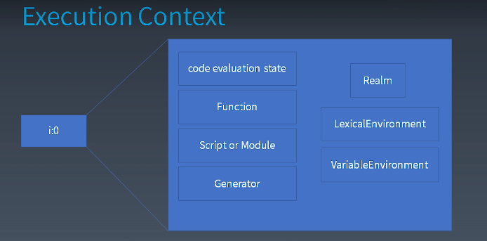

## 学习笔记
- Atom
- Expression
- Statement
- Structure
- Program/Module
### 1. Atom
语法树与运算符优先级的关系:  
乘除会优先形成更小一级的语法结构，加减会形成更高一级的语法结构  
运算符的优先级会影响语法树的构成  
JavaScript的标准中用产生式描述运算符的优先级

### 2. Expression
1. Member
    - a.b  成员访问   取出来的是引用 [reference](https://developer.mozilla.org/en-US/docs/Web/JavaScript/Reference)
    - a[b] 成员访问  b支持运行时字符串
    - foo`string`
    - super.b 用在Class构造函数
    - super[ 'b' ]
    - new.target
    - new Foo()
2. New
    - new Foo
        new a()() // ()是跟着new的 而不是函数调用
        new new a() // ()是第二个new的
3. Call
    - foo()
    - super()
    - foo()['b']
    - foo().b
    - foo()`abc`
        new a()['b']  // ()跟着new    new一个a对象，然后访问它的b属性
4. Update
5. Unary 单目运算
6. Exponental
7. Multiplicative
8. Additive
9. Shift
10. Relationship
11. Equality 
12. Bitwise  
13. Logical
14. Conditional
### 3. Statement
Completion Record:  
[[type]]: normal break continue return throw  
[[value]]: 基本类型  
[[target]]: label  
利用 Completion Record 分析语句执行的结果。  

### 4. Structure
#### JS执行粒度(运行时)  
- 宏任务
- 微任务  promise
- 函数调用  Execution Context
- 语句/声明 
- 表达式
- 直接量/变量/this...
#### 函数调用
- Execution Context Stack 执行上下文
- Runing Execution Context  
    
### 5. Program/Module