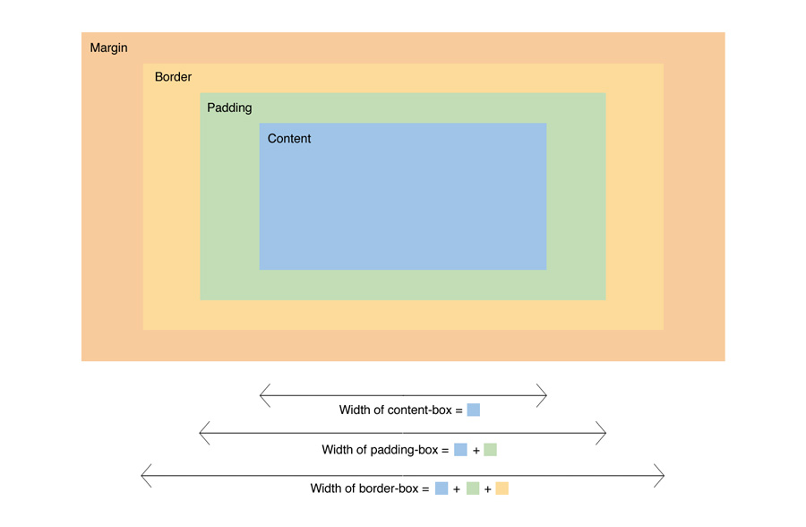
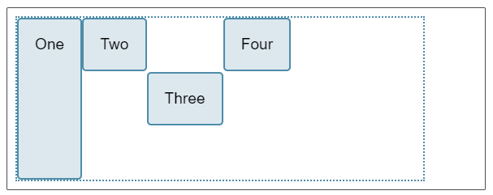
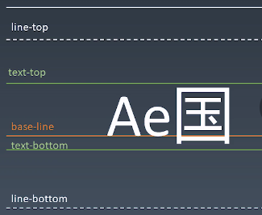

# 重学CSS 学习笔记
- CSS排版
  - CSS排版：盒模型
  - CSS排版：三代排版技术： 正常流(Normal Flow) 、flex 、 grid （3.5代：[CSS houdini](https://developer.mozilla.org/en-US/docs/Web/Houdini) JS可干预的排版）
- CSS动画与绘制
### 盒（Box）
HTML代码中可以书写开始<font color=yellow>标签</font>，结束<font color=yellow>标签 </font>，和自封闭<font color=yellow>标签 </font>。  
一对起止<font color=yellow>标签</font> ，表示一个<font color=yellow>元素</font> 。  
DOM树中存储的是<font color=yellow>元素</font>和其它类型的节点（Node）。  
CSS选择器选中的是<font color=yellow>元素</font>。  
CSS选择器选中的<font color=yellow>元素</font>，在排版时可能产生多个<font color=yellow>盒</font> 。  
排版和渲染的基本单位是<font color=yellow>盒</font> 。  
盒模型：  
  
参考链接：[The_box_model](https://developer.mozilla.org/zh-CN/docs/Learn/CSS/Building_blocks/The_box_model).

### 正常流排版
- 步骤  
  1. 收集盒进行(hang)
  2. 计算盒在行中的排布
  3. 计算行的排布  
- inline-level-formatting-context IFC
  - vertical-algin 只对行内元素、表格单元格元素生效：不能用它垂直对齐块级元素
    ```
    vertical-algin: baseling/top/middle/bottom/sub/text-top;
    ```
- block-level-formatting-context BFC
  - float 与 clear  
    float浮动的位置也受上一个浮动元素的影响  
    clear可实现float块元素换行  
    会发生重排，不建议频繁使用
  - margin collapse  
    只会发生在BFC中
  - **BFC合并** (以下情况合并BFC)  
    - block box && overflow: visible
  - **设立BFC** (以下几种情况会创建BFC)
    - floats
    - absolutely position element
    - block container that are not block boxes
    - and block boxes with 'overflow' other than 'visible'
### Flex排版
- 步骤  
  1. 收集盒进行
  2. 计算盒在主轴方向的排布
  3. 计算盒在交叉轴方向的排布
- 分行
  - 根据主轴尺寸，把元素分进行
  - 若设置了 no-wrap,则强行分配进第一行
- [主轴方向的计算](https://developer.mozilla.org/zh-CN/docs/Web/CSS/CSS_Flexible_Box_Layout/Controlling_Ratios_of_Flex_Items_Along_the_Main_Ax)
  - 找出所有flex元素
  - 把主轴方向的剩余尺寸按比例分配给这些元素
  - 若剩余空间为负数，所有flex元素为0，等比压缩剩余元素。
- [交叉轴方向的计算](https://developer.mozilla.org/zh-CN/docs/Web/CSS/CSS_Flexible_Box_Layout/Aligning_Items_in_a_Flex_Container)
  - 根据每一行中最大元素尺寸计算行高
  - 根据行高 align-items align-self 确定元素具体位置  
    
    ```
      .box {
        display: flex;
        align-items: flex-start;
        height: 200px;
      }
      .box>*:first-child {
          align-self: stretch;
      }
      .box .selected {
          align-self: center;
      }
        
      ```
      ```
      <div class="box">
        <div>One</div>
        <div>Two</div>
        <div class="selected">Three</div>
        <div>Four</div>
      </div>
      ```  

### 其他概念
1. baseline
2. Text
3. 行模型  
    
    - [vertical-align](https://developer.mozilla.org/zh-CN/docs/Web/CSS/vertical-align)  
4. Block
    - Block Container :里面有BFC的的。能容纳正常流的盒，里面就有BFC。
      - block
      - inline-block
      - table-cell
      - flex item
      - grid cell
      - table caption
    - Block-level Box : 外面有BFC的  
      | Block level          | Inline levle               |
      | :---                 | :----                      |
      | display: block       | display: inline-block      |
      | display: flex        | display: inline-flex       |
      | display: table       | display: inline-table      |
      | display: grid        | display: inline-grid       |
      | ...                  | ...                        |
      display: run-in
    - Block Box = Block Container + Blok-level Box : 里外都有BFC。
5. BFC 合并的影响  
    - BFC合并与float
    - BFC合并与边距折叠

_________________

### CSS动画与绘制
- CSS控制表现  
  - 控制元素的位置和尺寸信息
  - 控制绘制渲染信息
  - 交互和动画信息
- Animation
  - @keyframes 来定义关键帧
  - animation 来使用动画
  - [animation属性是以下属性的简介形式](https://developer.mozilla.org/zh-CN/docs/Web/CSS/animation)
    > animation-name   
    > animation-duration  
    > animation-timing-function  
    > animation-delay  
    > animation-iteration-count  
    > animation-direction  
    > animation-fill-mode  
    > animation-play-state  
- transition
  - [transition属性是以下属性的简写形式](https://developer.mozilla.org/zh-CN/docs/Web/CSS/transition)
    > transition-property  
    > transition-duration  
    > transition-timing-function  
    > transition-delay  
  - [三次贝塞尔曲线](https://cubic-bezier.com/)
    - 牛顿积分法
    - 贝塞尔曲线的拟合
- 颜色
  - CMYK与RGB
  - HSL和HSV  
    只需要更换色相就可以改变整个页面的风格
- 绘制
  - 几种类型
    - 几何图形
      - border
      - box-shadow
      - border-radius
    - 文字
      - font
      - text-decoration
    - 位图
      - background-image
  - 图形库
    - Skiz
    - Shader
  - 应用技巧
    - data uri + svg
  
