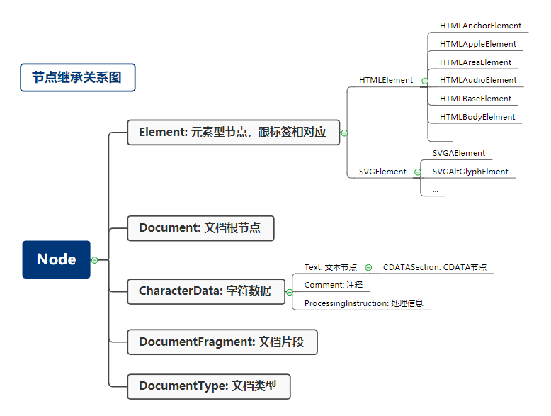

## HTML
### HTML的定义：XML与SGML
- DTD
- XML的namespace
### HTML标签语义
- figure
- em
- strong
- abbr
- pre
- samp
- `&lt;`
- code
- main aside article footer nav
### HTML语法
- 合法元素的写法
  - Element: &lt;tagname>...&lt;/tagname>
  - Text: text
  - Comment: `<!-- coments -->`
  - DocumentType: `<!Doctype html>`
  - ProcessingInstruction: `<?a 1?>`
  - CDATA: `<![CDATA[]]>`
- 字符引用
  - &#161; <-> `&#161;` 
  - &amp; <-> `&amp;`
  - &lt; <-> `&lt;`
  - &quot; <-> `&quot;`
-----
## 浏览器API
### DOM API
- 节点继承关系

- 导航类操作  
  |    node           | element                |
  | :---              | :----                  |
  | parentNode        | parentElement          |
  | childNodes        | children               |
  | firstChild        | firstElementChild      |
  | lastChild         | lastElementChild       |
  | nextSibling       | nextElementSibling     |
  | previousSibling   | previousElementSibling |
- 修改操作
  - appendChild
  - insertBefore
  - removeChild
  - replaceChild
- 高级操作
  - compareDocumentPosition 
  - contains
  - isEqualNode
  - isSameNode
  - cloneNode
### 事件API
  - [addEventListener](https://developer.mozilla.org/en-US/docs/Web/API/EventTarget/addEventListener)
### Range API
  - [Range API](https://developer.mozilla.org/en-US/docs/Web/API/Range)
  - [living collection](https://developer.mozilla.org/en-US/docs/Web/API/NodeList)
  - ```
    var range = new Range()
    range.setStart(element, 9)
    range.setEnd(element, 4)
    var range = document.getSection().getRangeAt(0)
    ```
  - ```
    range.setStartBefore
    range.setEndBefore
    range.setStartAfter
    range.setEndAfter
    range.selectNode
    range.selecNodeContents
    ```
  - ```
    var fragment = range.extractContents()
    range.insertNode(document.createTextNode("aaa))
    ```

