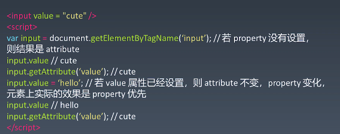

## 组件化
### 概念和基本组成
- [概念](https://developer.mozilla.org/zh-CN/docs/Web/Web_Components)
  > 特殊的对象或者特殊的模块
- 对象和组件
  - 对象： Properties Methods Inherit
  - 组件： Properties Methods Inherit Attribute Config & State  Event LifeCycle Children
- Attribute vs Property
  - Attribute 强调描述性
  - Property 强调从属关系
  - ```
    <div class="cs1 cs2"></div> <!-- class是attribute -->
    <script>
      var div = document.getElementByTagName("div");
      div.className // cs1 cs2    className 是 property
    </script>
    ```
  - `div.style` 得到key value 结构   p
  - `a.href`  得到URL resolve的结果  p
  - `input value`
    

- 如何设计组件状态  
  | Markup set | js set | js change | User input change |           |
  | :---       | :----  | :----     | :----             | :----     |
  | ×          | √      | √         | ？                | property  |
  | √          | √      | √         | ？                | attribute |
  | ×          | ×      | ×         | √                 | state     |
  | ×          | √      | ×         | ×                 | config    |
- LifeCycle
  
- Children
  - Content型
  - Template型
### 为组件添加JSX语法
- 搭建JSX环境
  ```
  mkdir jsx
  ```
  ```
  cd jsx
  ```
  ```
  npm init
  ```
  ```
  npm install -g webpack webpack-cli
  ```
  ```
  npm install --save-dev webpack babel-loader
  ```
  创建 webpack.config.js
  ```
  module.exports = {
    entry: "./main.js"   // 需要创建main.js
  }
  ```
  此时执行webpack 会发现多出来dist目录
  ```
  npm install --save-dev @babel/core @babel/preset-env
  ```
  在webpack.config.js配置babel
  ```
  module.exports = {
    entry: "./main.js",   // 需要创建main.js
    module: {
      rules: [
        {
          test: /\.js$/,
          use: {
            loader: "babel-loader",
            options: {
              presets: ['@babel/preset-env']
            }
          }
        }
      ]
    }
  }
  ```
  可以运行 webpack看看。至此JSX环境配置好。
  下面是可选的
  ```
  module.exports = {
    ...
    mode: "development"   // 发布的时候改成production。开发者模式下代码不压缩
  }
  ```
  ---
  - 支持JSX
  ```
  npm install --save-dev @babel/plugin-transform-react-jsx
  ```
  在webpack.config.js中配置
  ```
  ...
          use: {
            loader: "babel-loader",
            options: {
              presets: ["@babel/preset-env"],
              plugins: ["@babel/plugin-transform-react-jsx"]
            }
          }
  ```
- jsx基本用法
  - 简单修改jsx  webpack.config.js
     ```
    plugin: [["@babel/plugin-transform-react-jsx", {pragma: "createElement"}]]
    ```
  - main.js createElement
    ```
    function createElement(type, attributes, ...children) {
      let element
      if(typeof type === "string") {
        element = new ElementWrapper(type);
      } else {
        element = new type;
      }
      for (let name in attributes) {
        element.setAttribute(name, attributes[name]);
      }
      for (let child of children) {
        if(typeof child === "string") {
          child = new TextWrapper(child);
        }
        element.appendChild(child);
      }
      return element;
    }

    class ElementWrapper {
      constructor(type) {
        this.root = document.createElement(type);
      }
      setAttribute(name, value) {
        this.root.setAttribute(name, value);
      }
      appendChild(child) {
        child.mountTo(this.root);
      }
      mountTo(parent) {
        parent.appendChild(this.root);
      }
    }

    class TextWrapper {
      constructor(content) {
        this.root = document.createTextNode(content);
      }
      setAttribute(name, value) {
        this.root.setAttribute(name, value);
      }
      appendChild(child) {
        child.mountTo(this.root);
      }
      mountTo(parent) {
        parent.appendChild(this.root);
      }
    }

    class Div {
      constructor() {
        this.root = document.createElement("div");
      }
      setAttribute(name, value) {
        this.root.setAttribute(name, value);
      }
      appendChild(child) {
        child.mountTo(this.root);
      }
      mountTo(parent) {
        parent.appendChild(this.root)
      }
    }
    ```

### 其他
- 组件化： 主要目的是复用
- 架构模式： MVC MVVM
- webpack-dev-server