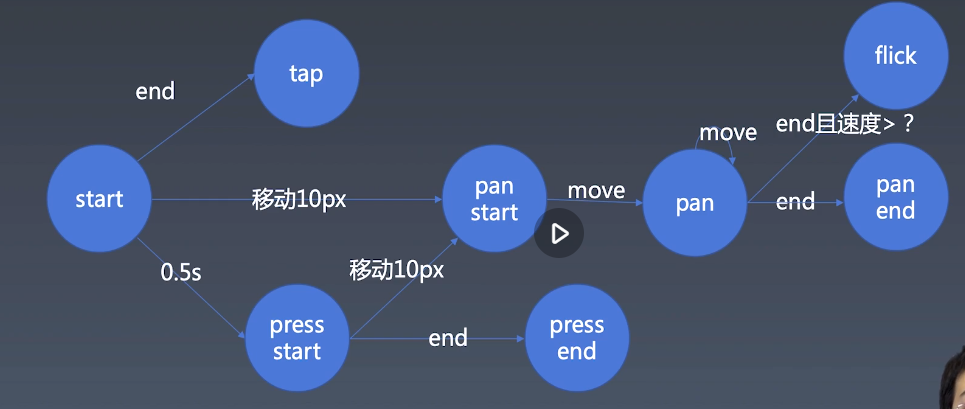

## Carousel 组件
重点：如何抽象 开发组件所需要的 底层能力
### 基础轮播组件
- TODO 补上上一周关于此部分的笔记
### 动画
- 初步建立动画与时间线
  ```
    export class Timeline {
        constructor() {
            this[ANIMATIONS] = new Set();
            this[START_TIME] =  new Map();
        }

        start() {
            let startTime = Date.now();
            this[TICK] = () => {
                // console.log("tick");
                let now = Date.now();
                for (let animation of this[ANIMATIONS]) {
                    let t;
                    if (this[START_TIME].get(animation) < startTime) {
                        // 动画开始以前 添加的animation
                        t = now - startTime;
                    } else {
                        // 动画开始以后添加的animation
                        t = now - this[START_TIME].get(animation);
                    }
                    if (animation.duration < t) {
                        this[ANIMATIONS].delete(animation);
                        t = animation.duration;
                    }
                    animation.receiveTime(t);
                }
                requestAnimationFrame(this[TICK]);
            }
            this[TICK]();
        }

        /*set rate() { }
        get rate() { }*/ 

        pause() { } // 暂停
        resume() { } // 恢复

        reset() { }

        add(animation, startTime) {
            if (arguments.length < 2) {
                startTime =  Date.now();
            } // 参数不足的时候，给startTime一个默认值
            this[ANIMATIONS].add(animation);
            this[START_TIME].set(animation, startTime);
        }
        remove() {

        }
    }

    export class Animation {
        constructor(object, property, startValue, endValue, duration, delay, timingFunction) {
            this.object = object;
            this.property = property;
            this.startValue = startValue;
            this.endValue = endValue;
            this.duration = duration;
            this.timingFunction = timingFunction;
            this.delay = delay;
        }
        receiveTime(time) {
            let range = (this.endValue -  this.startValue);
            this.object[this.property] = this.startValue + range * time / this.duration
        }
    }

  ```
  用法
  ```
    let tl = new Timeline();
    window.tl = tl;
    window.animation = new Animation({ set a(v) { console.log(v) }}, "a", 0, 100, 1000, null);
    tl.add(animation);

  ```
- 暂停和重启
  ```
    pause() {
        this[PAUSE_START] = Date.now(); // 暂停事件发生的时间
        cancelAnimationFrame(this[TICK_HANDLER]); //  动画彻底停下来了
    } // 暂停
    resume() {
        this[PAUSE_TIME] += Date.now() -  this[PAUSE_START]; // 暂停持续的时间
        this[TICK]();
    } // 恢复
  ```
- 动画
- 时间线状态管理
  ```
    if (this.state !== "started") {
            return;
    }
    this.state = "paused";
  ```
### 手势 gesture
- 
- 鼠标和touch抽象
  ```
    let element = document.documentElement; // Document.documentElement 是一个会返回文档对象（document）的根元素的只读属性

    // 鼠标
    element.addEventListener("mousedown", event => {
        start(event);
        let mousemove = event => {
            // console.log(event.clientX, event.clientY);
            move(event);
        }
        let mouseup = event => {
            end(event);
            element.removeEventListener("mousemove", mousemove); // capture once passive
            element.removeEventListener("mouseup", mouseup)
        };
        element.addEventListener("mousemove", mousemove);
        element.addEventListener("mouseup", mouseup);
    })

    // 触屏
    element.addEventListener("touchstart", event => {
        for (let touch of event.changedTouches) {
            // console.log("start", touch.clientX, touch.clientY);
            start(touch);
        }
    })
    element.addEventListener("touchmove", event => {
        for (let touch of event.changedTouches) {
            // console.log("move", touch.clientX, touch.clientY);
            move(touch);
        }
    })
    element.addEventListener("touchend", event => {
        for (let touch of event.changedTouches) {
            // console.log("end", touch.clientX, touch.clientY);
            end(touch);
        }
    })
    element.addEventListener("touchcancel", event => {
        for (let touch of event.changedTouches) {
            // console.log("cancel", touch.clientX, touch.clientY);
            cancel(touch);
        }
    }) // 触屏会被alert等其他系统操作打断 这个时候会发生 touchcancel

    let start = (point) => {
        console.log("start", point.clientX, point.clientY);
    }

    let move = (point) => {
        console.log("move", point.clientX, point.clientY);
    }

    let end = (point) => {
        console.log("end", point.clientX, point.clientY);
    }

    let cancel = (point) => {
        console.log("cancel", point.clientX, point.clientY);
    }
  ```
- isTap isPan isPress 判断
- 处理鼠标事件
- 如何派发事件
  ```
    function dispatch(type, properties) {
        // let event = new CustomEvent()
        let event = new Event(type);
        console.log(event);
        for (let name in properties) {
            event[name] = properties[name];
        }
        element.dispatchEvent(event); // 派发在element上
    }
  ```
  - flick 事件: 关键是对速度的处理---计算点集平均速度
  - 封装  解耦： listen recognize dispath

### 其他
- TODO 补上上一周关于轮播组件的笔记
- 整理代码结构 Carouse提取到carousel.js
- 所有的软件都会对齐到60帧，所以我们用Math.floor(1000/60=16毫秒
- [requestAnimationFrame(tick)](https://developer.mozilla.org/zh-CN/docs/Web/API/Window/requestAnimationFrame) 在下次重绘之前调用指定的回调函数tick更新动画
- cancelAnimationFrame(handler) 取消requestAnimationFrame对应的handler
- animation 属性动画:把一个属性的值变成另一个值。帧动画：动画场景里一帧一帧的画。
- delay 放在时间线里，在add animation的时候添加delay
- [animation](http://trac.webkit.org/browser/trunk/Source/WebCore/platform/animation)
- [document.documentElement](https://developer.mozilla.org/zh-CN/docs/Web/API/Document/documentElement)
- event.button 可以用来判断按下了哪个键
- event.buttons 表示有哪些键被摁下来了
- [CustomEvent](https://developer.mozilla.org/zh-CN/docs/Web/API/CustomEvent)
- [Event](https://developer.mozilla.org/en-US/docs/Web/API/Event/Event)
- [dispatchEvent](https://developer.mozilla.org/en-US/docs/Web/API/EventTarget/dispatchEvent)


