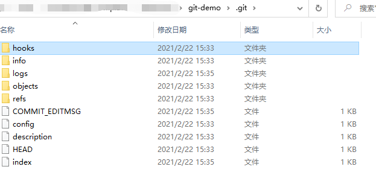
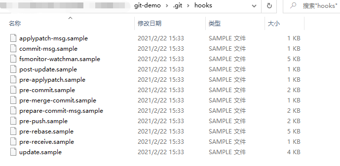

## 持续集成
- 相关概念：`daily build`、 `BVT`、`无头浏览器`、`web hooks`
- 本章重点：  
  1. Git Hooks 完成检查时机
  1. ESLint 检查代码
  1. ~~PhantomJS~~ 基于无头浏览器对最后生成的代码做一些规则的校验和检查
### 1. Git Hooks 基本用法
- Client-Side Hooks
- git init 后会生成.git目录，里面包含 hooks文件夹。hooks文件夹中的文件以sample结尾，并不会实际执行。去掉 `.sample`就会变成Linux可执行文件。
    
    
  注意hooks文件夹中的`pre-commit.sample`和 `pre-push.sample`  
  💡 把lint之类的操作放到pre-commit里  把最终check操作放到push里
- commit 拦截,也可以做有条件的拦截
  ```
    let process = require("process")
    process.exit(1)
  ```
### 2. ESLint 基本用法
- 安装
  ```
    npm install eslint --save-dev
  ```  
  💡 一定是--save-dev
- 初始化
  ```
    npx eslint --init
  ```  
  会生成配置文件`.eslintrc.js`
- 用法
  ```
    npx eslint yourfile.js
  ```
- 💡 检查需要提交的版本而不一定是现在文件呈现的版本。需要用到git的一个命令  `git stash push -k`

### 3. 用无头浏览器做发布前的检查
- Chrome 的 Headless模式
- [Puppeteer](https://www.npmjs.com/package/puppeteer)

---
### 相关文档
1. [Git Hooks](https://git-scm.com/book/en/v2/Customizing-Git-Git-Hooks)
1. [ESLint](https://eslint.org/)
1. [ESLint Node.js API](https://eslint.org/docs/developer-guide/nodejs-api)
1. [git stash](https://git-scm.com/docs/git-stash)
1. [headless-chrome](https://developers.google.com/web/updates/2017/04/headless-chrome)
1. [puppeteer](https://developers.google.com/web/tools/puppeteer)
1. [puppeteer api](https://github.com/puppeteer/puppeteer/blob/v7.1.0/docs/api.md)
### 其他
- Windows 打开文件/夹  start .git
- 类Linux系统  打开文件/夹 open ./.git
- which node
- `ls -l pre-commit.sample` 可查看 `pre-commit.sample`文件的权限
- chmod 修改权限 x是执行的权限  
  `chmod +x ./pre-commit`  
  我在Win10里 直接在相应的文件第一行写入 `#!/bin/sh` 然后文件权限 有x  
  写入类似的也行
- [gyp ERR! find VS not looking for VS2013 as it is only supported up to Node.js 8](https://juejin.cn/post/6897104970470916103)

  
